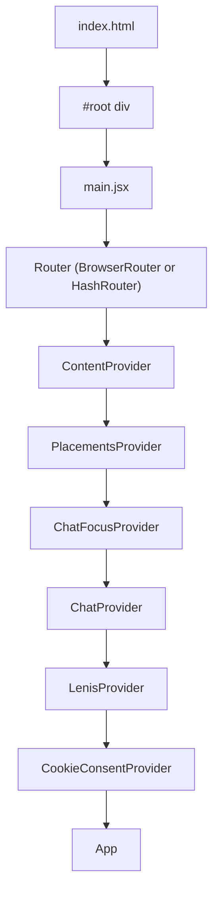
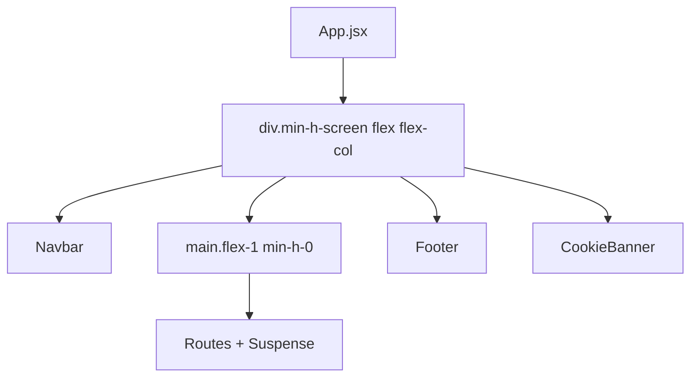
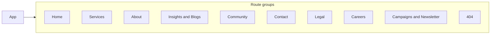

# Cache Digitech - Frontend Architecture

This document describes the structure of the Cache Digitech frontend application and how its main pieces fit together.

## Stack and repo layout

- **Runtime**: React 18, Vite 7
- **Routing**: React Router v7
- **Styling**: Tailwind CSS v4
- **Deployment**: Frontend-only; no backend in this repo. The app can be served as static files (e.g. from Vercel or any static host).

The project root contains a `frontend/` directory that holds the entire React app. All paths below are relative to `frontend/`.

## Entry point and provider tree

The app is bootstrapped from `index.html` and [src/main.jsx](src/main.jsx). The entry point chooses `BrowserRouter` for normal hosting or `HashRouter` when opened via `file://` (e.g. from a built `dist` folder), then wraps the tree in six context providers before rendering `App`.

**Provider order** (outer to inner): Router → ContentProvider → PlacementsProvider → ChatFocusProvider → ChatProvider → LenisProvider → CookieConsentProvider → App. When adding new global context, place its provider in this chain in [main.jsx](src/main.jsx).

## App shell (layout)

[App.jsx](src/App.jsx) defines the single shell used on every page: a full-height flex column with a fixed Navbar, a scrollable main area (routes), a Footer, and a CookieBanner. There is no per-route layout wrapper; all routes render inside the same `<main>`.

- **Navbar**: Global header; shared across all pages.
- **main**: Contains `<Suspense>` and `<Routes>`. Page components are lazy-loaded; a shared `PageLoader` is used as the Suspense fallback.
- **Footer**: Global footer; shared across all pages.
- **CookieBanner**: Shown when cookie consent is needed.

## Routing and code-splitting

All routes are defined in [App.jsx](src/App.jsx). There are 30+ routes. Each page component is loaded with `React.lazy()`, so only the active route’s chunk is loaded on demand.

Route groups (logical; not every path listed):

| Group | Purpose |
|-------|--------|
| **Home** | `/` - HomePage |
| **Services** | `/service/infra`, `/service/network`, `/service/cloud-solutions`, `/cloudservices`, `/cybersecurity`, `/infrastructureservice`, `/aianddataservice`, `/manageservices`, `/consultingservice`, `/grc-dashboard`, `/telecom` |
| **About** | `/about`, `/about/profile`, `/about/awards`, `/about/alliances`, `/about/leadership`, `/innovations` |
| **Insights / Blogs** | `/insights`, `/blogs`, `/case-studies`, `/blog/:id` |
| **Community** | `/community`, `/developerteam` |
| **Contact** | `/contact`, `/contactus` |
| **Legal** | `/privacy-policy`, `/terms-of-use`, `/epf-amendment-notice` |
| **Careers** | `/careers` |
| **Notifications** | `/campaigns`, `/newsletter`, `/offers` |
| **Catch-all** | `*` → NotFoundPage |

## Folder structure

| Path | Purpose |
|------|--------|
| **src/Pages/** | Route-level page components (e.g. ContactUsPage, BlogsPage, Career, PrivacyPolicyPage). One (or a few) pages per route. |
| **src/Render_Pages/** | HomePage and service-detail - home and service landing pages. |
| **src/components/** | Reusable and feature-specific UI. Subfolders: **HomeComponent** (Navbar, Footer, HeroSection, CareersSection, etc.), **AboutPageComponent**, **CommunityComponent**, **InsightComponent**, **ServicesComponent**, **figma**, **ui** (shared primitives). |
| **src/context/** | React context providers: ContentContext, PlacementsContext, ChatFocusContext, ChatContext, LenisContext, CookieConsentContext. |
| **src/data/** | Static or structured data (e.g. blogsAndHighlights). |
| **src/utils/** | Helpers (e.g. cookieManager). |
| **src/css/** | Global or feature CSS (e.g. slider.css, index.css). |

## Key integrations

- **Zoho Forms**: Contact Us page embeds a Zoho form via an iframe; no backend required. Form URL is configured in [ContactUsPage.jsx](src/Pages/ContactUsPage.jsx).
- **Lenis**: Smooth scrolling. Provided by LenisProvider; used via `useLenis()` (e.g. in App for scroll-to-top on route change).
- **PlacementsContext**: Optional overrides for copy, images, or links (CMS-like). Used by some components via `usePlacement()`.
- **Cookie consent**: CookieConsentContext and CookieBanner handle consent and cookie policy; cookieManager in utils supports persistence.

## Summary

The app is a single-page React shell (Navbar + main + Footer + CookieBanner) with many lazy-loaded route components. Global state is provided by six contexts in a fixed order in main.jsx. Routing and code-splitting are centralized in App.jsx. There is no backend in the repo; the frontend is built with Vite and can be deployed as static assets.
